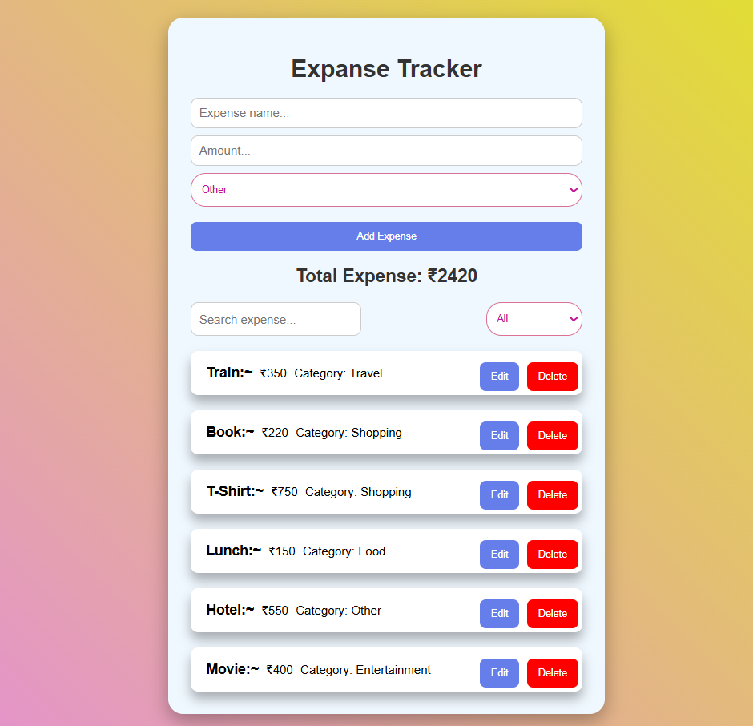

## 💰 Expense Tracker

A responsive Expense Tracker built with React.js to manage daily expenses with search, filtering, editing, and Local Storage.

## ✨ Features

- ➕ Add new expenses
- ✏️ Edit existing expenses
- 🗑️ Delete expenses
- 🔍 Search expenses by name
- 🏷️ Filter expenses by category
- 💵 Calculate total expenses
- 💾 Persist data using Local Storage
- 📱 Responsive design

## 🛠️ Tech Stack

- React.js
- JavaScript
- HTML
- CSS
- Local Storage

## 🧠 React Concepts Used

- "useState"
- "useEffect"
- Props
- Event Handling
- Conditional Rendering
- "map()", "filter()", "reduce()"
- Controlled Inputs
- Component-based Architecture


## 🎯 Purpose

Built as a React practice project to strengthen:

- 🧩 Component-based development
- 🔄 CRUD operations
- 📦 State management
- 🔎 Search & filtering
- 💾 Local Storage
- ♻️ Reusable components

## 📂 Project Structure
```
src/
├── assete/
│   └── Screenshot.png
├── components/
│   ├── ExpenseForm.jsx
│   ├── FilterBar.jsx
│   ├── ExpenseList.jsx
│   └── ExpenseItem.jsx
├── Expense.jsx
├── App.jsx
├── main.jsx
└── index.css
```

## Project Screenshot



## 🚀 Getting Started

```bash
npm install
npm run dev