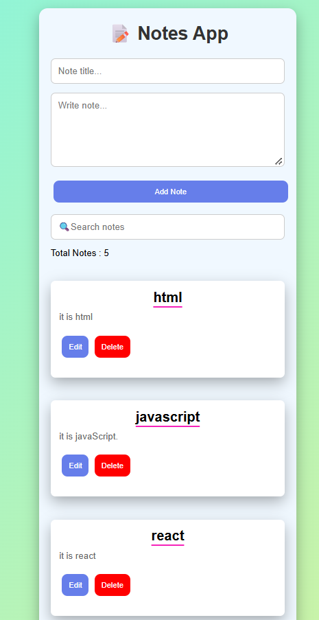

# React Notes-App

A responsive Notes App built with React.js for creating, searching, editing, and deleting notes.

## Features

- Add notes with title and content
- Search notes by title
- Edit and delete notes
- Delete confirmation
- Local Storage persistence
- Responsive UI

## Tech Stack

- React.js
- JavaScript
- HTML5
- CSS3
- Local Storage

## Project Structure
```
Notes-App/
├── src/
│   ├── assets/
│   │   └── screenshot.png
│   ├── components/
│   │   ├── NoteForm.jsx
│   │   ├── NoteList.jsx
│   │   └── Notes.jsx
│   ├── App.jsx
│   ├── main.jsx
│   └── index.css
├── index.html
├── package.json
└── README.md

```
## React Concepts

- Components
- useState
- Props
- Event Handling
- map()
- filter()
- useEffect
- localStorage

## Project Screenshot




## Run Locally

```bash
npm install
npm run dev