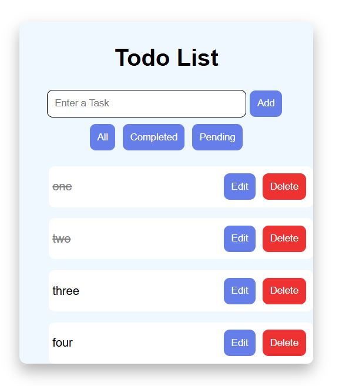

# React To-Do List

A To-Do List application built using React.js.

## Features

- Add tasks
- Delete tasks
- Mark tasks as completed
- Save in local storage
- Edit task
- Filter task like all, complete, pending

## Technologies

- React.js
- JavaScript
- JSX
- CSS
- Vite

## Project Structure

```
todo-app/
├── src/
│   ├── assets/
│   │   └── screenshot.png
│   ├── components/
│   │   ├── TodoForm.jsx
│   │   └── TodoItem.jsx
│   ├── App.jsx
│   ├── main.jsx
│   └── index.css
├── index.html
├── package.json
└── README.md
```
## React Concepts

- Components
- useState
- Props
- Event Handling
- map()
- filter()
- useEffect
- localStorage

## Project Screenshot




## Run Locally

```bash
npm install
npm run dev