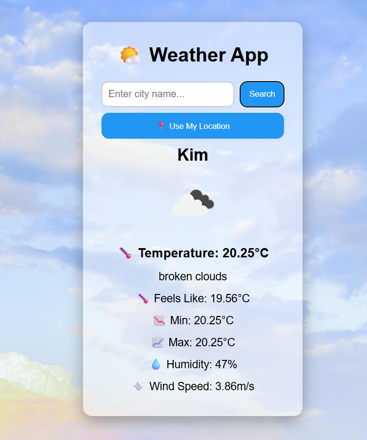

# 🌤️ Weather App

A responsive weather application built with React.js that provides real-time weather information using the OpenWeatherMap API.

## 🚀Features

- 🔍 Search weather by city
- 📍 Get weather using current location
- 🌡️ Current temperature in Celsius
- 🤗 Feels-like temperature
- 📈 Minimum & maximum temperature
- 💧 Humidity information
- 💨 Wind speed
- 🌤️ Dynamic weather icons
- ⚡ Loading and error states
- 📱 Responsive design

## 🛠️Tech Stack

- React.js
- JavaScript (ES6+)
- CSS3
- OpenWeatherMap API
- Vite

## React Concepts Used

- Functional Components
- Props
- useState
- Async/Await
- Fetch API
- Conditional Rendering
- Event Handling
- Browser Geolocation API
- Environment Variables

## Purpose

This project was built to practice React fundamentals, API integration, asynchronous JavaScript, state management, and browser geolocation.

## 📁 Project Structure
```
Weather-App/
├── src/
│   ├── assets/
│   │   └── blue-sky.jpg
│   │   └── Screenshot.png
│   ├── components/
│   │   ├── SearchBar.jsx
│   │   ├── Weather.jsx
│   │   └── WeatherCard.jsx
│   ├── App.jsx
│   ├── main.jsx
│   └── index.css
├── index.html
├── package.json
└── README.md
```

## Project Screenshot



## Getting Started

1. Clone the repository

- git clone <your-repository-url>
- cd weather-app

2. Install dependencies
```
npm install
```

3. Configure API Key

- Create a ".env" file in the project root:

- VITE_WEATHER_APIKEY=your_api_key

- Get an API key from OpenWeatherMap.

4. Start the development server
```
npm run dev
```